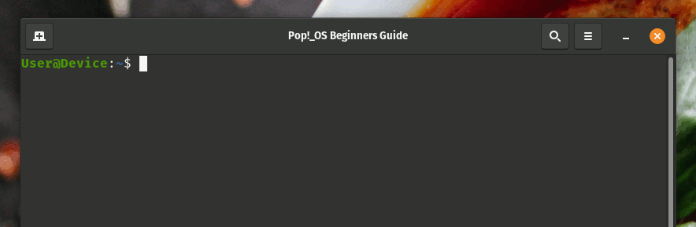
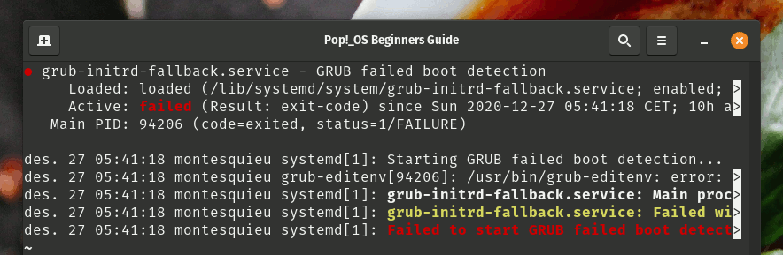
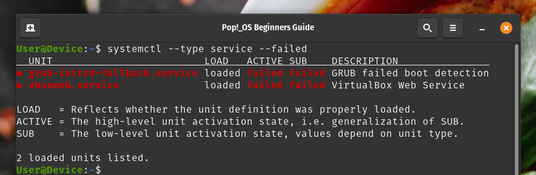
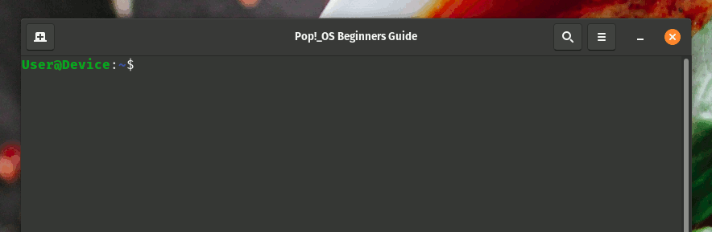

# Beginners guide to systemctl (Part 1): Services

For an operating system to operate properly it needs to have certain functions that it can count on, applications that run in the background and take care of some logic and legwork to sustain a modern operating system. Services like a network or bluetooth manager, a print spool manager, and so on. These applications are what we call `services`.  `Systemd` manager services, among other things. This is done through the `systemctl` tool- To run it you'll need to crack open your favourite terminal, probably by pressing the superkey and writing "terminal". Once you've got it open let's check which services we have running.

Seeing as `systemctl` doesn't just manage system and user services, but all sorts of other things that combine to become a full blown system management tool, we'll stick to the basics on how to manage our services for now. Let's begin with a list! Crack open **gnome-terminal** and run this command:

```bash
systemctl --type service
```



This will open up an overview of services that are currently loaded or that have failed. To browse the list use the keyboard arrow down to move further down the list and the left arrow key to see what the descriptions of the services are. From here we can see all the usual suspects, like `polkit.service`, `gdm.service` and in the case of *Pop!_OS_* you have `system76-power.service`. Let's take a look at that particular service by using the command:

```bash
systemctl status system76-power.service
```


Here we can see everything is fine. It's been loaded from `/etc/systemd/system/system76-power.service`, it's *enabled*, *active* *and* *running*. You can also see the "Process ID" (or "PID"), number of tasks, memory usage and even cgroup membership. We also see a snippet from the log of this particular service. Everything looks peachy keen, but if we scroll down we see that there's a problem with the service `grub-initrd-fallback.service`.  So we use the same command (`systemctl status`) but replace `grub-initrd-fallback.service` with `grub-initrd-fallback.service` to see what's going on with it.



As we can see here `grub-initrd-fallback.service` is not a happy camper. It has been **loaded**, but it isn't **active** and didn't **end properly**. This means that it was meant to be loaded with the system, the unit is technically active, but the process crashed because of some failure. In the log we can see that it has en error where the process can't find the file `/boot/grub/grubenv.new`. As it so happens I know this is because I installed some `grub` packages for testing purposes that I don't really need, since I use `systemd-boot`! Therefore, in this case I can safely ignore this error, quite possibly consider removing said packages and move on with checking out my services. But what if I have more errors? Let's return to the first command, but add an extra qualifier to it.

```bash
systemctl --type service --state failed
```

Here we introduce a new property. **State** can be several things depending upon the unit, but in this case we're looking for `failed services`. I can make the command even shorter by doing the shorthand:

```bash
systemctl --type service --failed
```

Both these commands will yield the same result, in my case being:



Here we can see that I have two services that aren't functioning properly. Both `grub-initrd-fallback.service` and `vboxweb.service` have failed! I'm one saaaaaad panda. As it stands I'm not using `grub` nor `virtualbox` for the moment, so I have no cares to give here. I think I'll just disable `vboxweb.service`so that it doesn't give me anymore errors. Disabling `grub-initrd-fallback.service` is ill-advised, unless you know what you're doing (like me!)

```bash
sudo systemctl disable vboxweb.service
```

I use `sudo` because you need administrative priveliges, but if you forget to write it you'll get a password popover prompt instead - so no stress!



That might cause some headscratching once I try to run `virtualbox` again, but then again maybe I should move to `boxes`? Depends. Actually, you know what? Let's get it working - so I'm gonna try to run it *without* enabling it.
